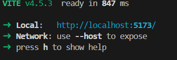

Đây là bài tập mã hoá và giải mã chữ ký số RSA, được viết bằng ngôn ngữ JavaScript và thư viện Reactjs

Cách chạy dự án:


b1: clone dự án
```bash
git clone https://github.com/Nguyenthithuhang0406/RSA-ATTT.git
```
b2: cài đặt lại package
```bash
npm install
```
b3: chạy lệnh 
```bash
npm run dev
```
nó sẽ ra như này: 



b4: sang trình duyệt google Chrome hay j đó paste link http://localhost:5173/ vào (nếu link ở máy cậu khác thì paste link máy cậu vào)